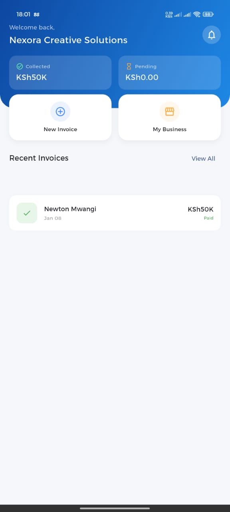
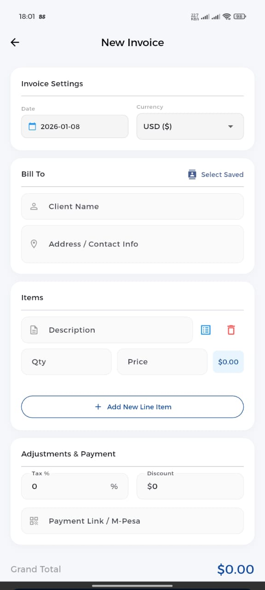
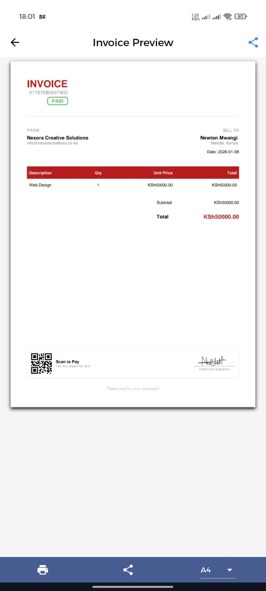
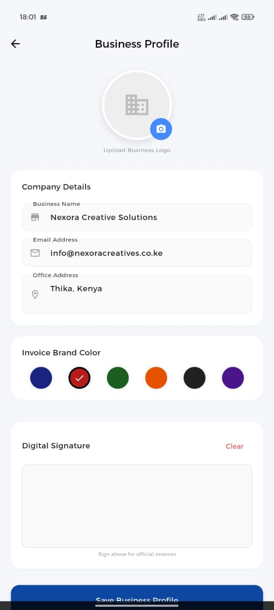

# 💎 Invoice Gem

**Invoice Gem** is a professional, offline-first mobile invoicing application built with **Flutter**. It allows freelancers and small business owners to generate sleek PDF invoices, track payments, and secure their financial data with biometric authentication.


## ✨ Features

* **📄 Professional PDF Invoices**: Generate branded invoices with your logo and signature in seconds.
* **🔒 Biometric Security**: Secure the app using Fingerprint or Face ID (via `local_auth`).
* **📊 Smart Dashboard**: Track "Collected" vs. "Pending" revenue at a glance.
* **👥 Client & Product Manager**: Save details once and auto-fill them in future invoices.
* **📂 Data Export**: Export your entire invoice history to CSV/Excel for accounting.
* **🌍 Multi-Currency**: Support for KSh, USD, EUR, GBP, NGN, and INR.
* **🚀 Offline First**: All data is stored locally on the device; no internet required.

## 📱 Screenshots

| Dashboard | Create Invoice | PDF Preview | Business Profile |
|:---:|:---:|:---:|:---:|
|  |  |  |  |


## 🛠️ Tech Stack & Packages

* **Framework**: Flutter (Dart)
* **State Management**: `setState` (Clean & Simple)
* **Local Storage**: `shared_preferences` (Data persistence)
* **PDF Generation**: `pdf` & `printing`
* **Security**: `local_auth` (Biometrics)
* **File Handling**: `path_provider`, `csv`, `share_plus`
* **Utilities**: `intl` (Date/Currency formatting), `package_info_plus`

## 🚀 Getting Started

### Prerequisites
* Flutter SDK installed.
* Android Studio / VS Code configured.

### Installation

1.  **Clone the repository:**
    ```bash
    git clone [https://github.com/yourusername/invoice-gem.git](https://github.com/Iconia7/Invoice-gem.git)
    cd invoice_generator
    ```

2.  **Install Dependencies:**
    ```bash
    flutter pub get
    ```

3.  **Run the App:**
    ```bash
    flutter run
    ```

## 📦 Building for Release (Android)

1.  **Generate App Bundle (.aab):**
    ```bash
    flutter build appbundle --release
    ```
    *Output location: `build/app/outputs/bundle/release/app-release.aab`*

2.  **Keystore Configuration:**
    Ensure you have your `invoice-gem-key.jks` in the `android/app/` directory and your `key.properties` file configured.

## 🔒 Privacy & Permissions

This app requires the following permissions:
* `USE_BIOMETRIC`: For app security.
* `READ_EXTERNAL_STORAGE` / `CAMERA`: To upload business logos.

## 👨‍💻 Developed By

**Nexora Creative Solutions**
* **Developer**: Newton Muchiri Mwangi
* **Focus**: FinTech, UI/UX, & Mobile Solutions

---
*© 2026 Nexora Creative Solutions. All Rights Reserved.*